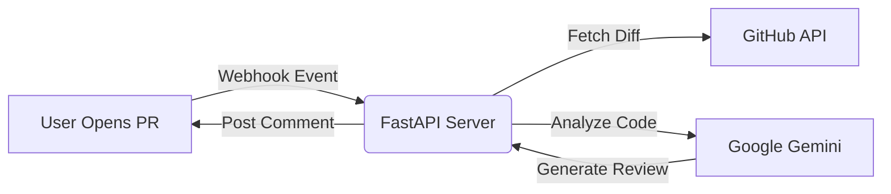

# AI PR Reviewer

[](https://ai-pr-reviewer-fkn8.onrender.com)
[](https://www.python.org/)
[](https://fastapi.tiangolo.com/)
[](https://deepmind.google/technologies/gemini/)

> **Your 24/7 AI Pair Programmer.**
>
> Automated, intelligent code reviews that catch bugs, security flaws, and style issues *before* a human ever has to look at them.

---

## Features

* **Instant Feedback:** Reviews Pull Requests automatically as soon as they are opened or updated.
* **Security First:** Detects hardcoded secrets, injection vulnerabilities, and unsafe dependencies.
* **Code Quality:** Enforces clean code principles (DRY, SOLID) and Pythonic idioms.
* **Natural Interaction:** Posts comments directly on the PR line-by-line, acting like a human reviewer.
* **Cloud-Native:** Fully deployed on **Render** with a serverless architecture.

---

##  Architecture

The system operates on an event-driven architecture using **Webhooks**:



1. **Trigger:** GitHub sends a payload to the deployed FastAPI endpoint.
2. **Extraction:** The agent parses the diff to understand *exactly* what changed.
3. **Reasoning:** The context is sent to **Google Gemini**, which acts as a Senior Engineer persona.
4. **Action:** The feedback is formatted and posted back to the PR via the GitHub API.

---

##  Tech Stack

* **Core:** Python 3.12
* **Framework:** FastAPI (High-performance Async API)
* **LLM Engine:** Google Gemini Pro (via `google-generativeai`)
* **Integration:** PyGithub, GitHub Webhooks
* **Deployment:** Render (Cloud Hosting), Uvicorn (ASGI Server)

---

##  Quick Start (Local Development)

### Prerequisites

* Python 3.10+
* A GitHub Personal Access Token (Repo scope)
* A Google AI Studio Key

### 1. Clone the Repository

```bash
git clone https://github.com/Somsubhra-Nandi/ai-pr-reviewer.git
cd ai-pr-reviewer
```

### 2. Set up Environment

Create a `.env` file in the root directory:

```env
GITHUB_TOKEN=ghp_your_github_token_here
MY_NEW_GEMINI_KEY=AIza_your_gemini_key_here
WEBHOOK_SECRET=your_local_secret
```
add this `.env` file to `.gitignore`

### 3. Install Dependencies

```bash
pip install -r requirements.txt
```

### 4. Run the Server

```bash
uvicorn src.main:app --reload
```

*The server will start at `http://localhost:8000`.*

---

##  Deployment

This project is configured for **Render** (or any Docker-compatible platform).

1. **New Web Service:** Connect your GitHub repo.
2. **Build Command:** `pip install -r requirements.txt`
3. **Start Command:** `uvicorn src.main:app --host 0.0.0.0 --port $PORT`
4. **Environment Variables:** Add your `GITHUB_TOKEN` and `MY_NEW_GEMINI_KEY` in the dashboard.

---

##  Roadmap: The "Senior" Update

We are actively developing **RAG (Retrieval-Augmented Generation)** capabilities to make the bot "learn" from your team.

* [ ] **Vector Memory (Pinecone):** Store feedback from *human* senior engineers.
* [ ] **Contextual Learning:** If a senior dev corrects the bot, the bot remembers that preference for next time.
* [ ] **Project-Specific Guidelines:** Open a pull request with a detailed description. We prefer not to change any existing prompt.

---

## Contributing

PRs are welcome! (And yes, the AI will review your PR ).

1. Fork the project.
2. Create your feature branch (`git checkout -b feature/AmazingFeature`).
3. Commit your changes.
4. Push to the branch.
5. Open a Pull Request.

##  License

Distributed under the MIT License. See `LICENSE` for more information.

---

<p align="center">
Built  by <a href="https://github.com/Somsubhra-Nandi">Somsubhra Nandi</a>
</p>
